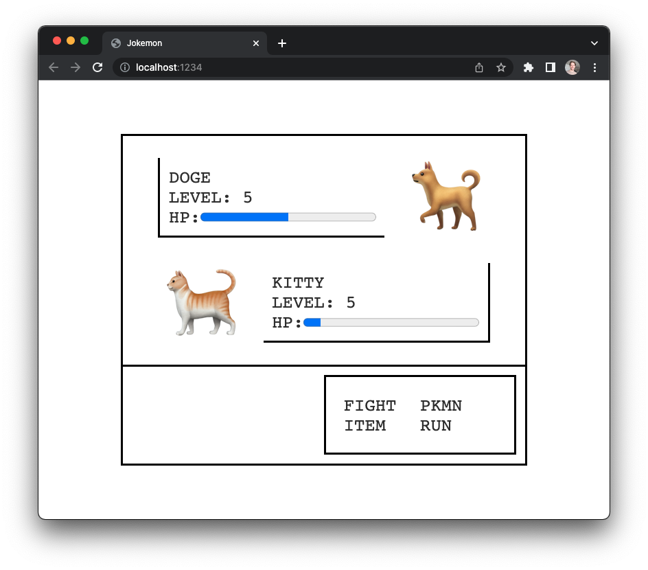

# jokemon
> a tiny pokemon clone made with elm land



## running it locally

1. Make sure you have [Node.js v16+](https://nodejs.org) installed

2. Run the following command:

```
npx elm-land server
```

3. The game will be running at http://localhost:1234